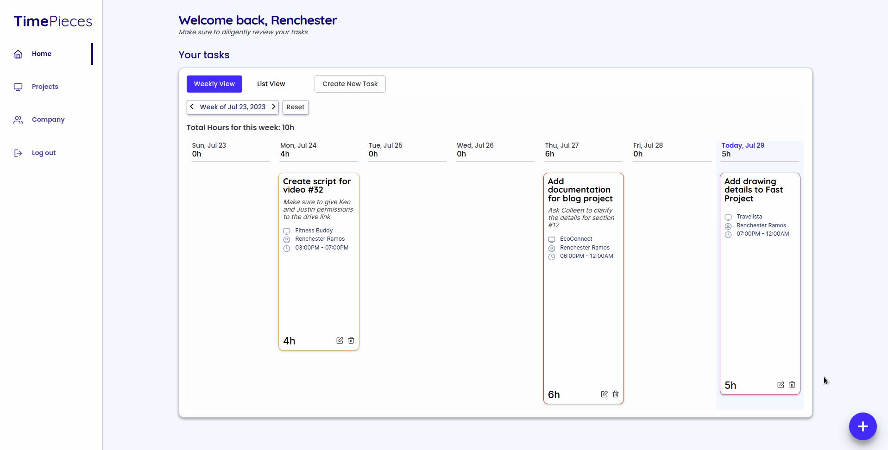

# TimePieces

TimePieces is a small app that allows you to input and view your tasks for the week to help with your productivity. Built with Vite + React.

## Installation

In order to setup and work on this project on your own, you will need to:

1. Clone this project using:\
   `git clone https://github.com/renchester/time-tracker-app.git`

2. Go to the folder/directory where you cloned the project and type the following into the CLI to install the required dependencies:\
   `npm install`

3. After installing dependencies, the distribution files can be produced using:\
   `npm run build`

4. Finally, a live demo of the project can be started by using:\
   `npm run preview`

5. Go to `http://localhost:4173/` to test the app out

6. _Alternatively_, you can go into development mode after installing the dependencies(#2) by typing `npm run dev` and following the instructions on the terminal

## Rationale

In the creation of this project, I was inspired by the idea of being able to display your data in multiple ways--much like how certain productivity apps give you the option to view your data in kanban-style view, calendar view, and many others. For this time-tracker app, initially I wanted to create multiple views but due to the time constraint, I limited the way one is able to see the tasks to a weekly overview as well as a list view. These views are wrapped inside a reusable panel which allows you to toggle between the two.

The app has three main routes: Home, Projects, and Workspace/Company. All three routes make use of the overview panel to view tasks. In the Home route, you are able to see the tasks that you have for the week. The Projects route provides an overview of the tasks divided per project. Lastly, the Workspace route allows you to view all the tasks that everyone is doing.

In order to address the ease of input, a button to add tasks is shown globally at the bottom right which allows one to access the modal to create a task. Buttons are also provided in the overview panels in order to fulfill the same role. When creating a task, the starting time is automatically set to the present date to make inputs easier and faster.

## To-do

1. Add a kanban-style view as well as a Gantt chart-style view for the tasks
2. Create a backend to store data

## View

